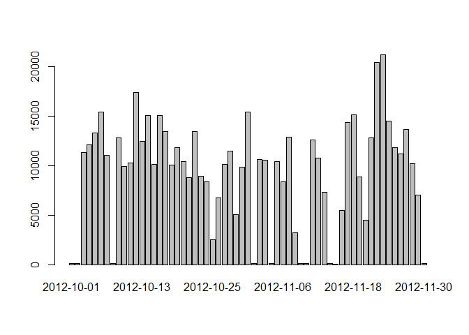
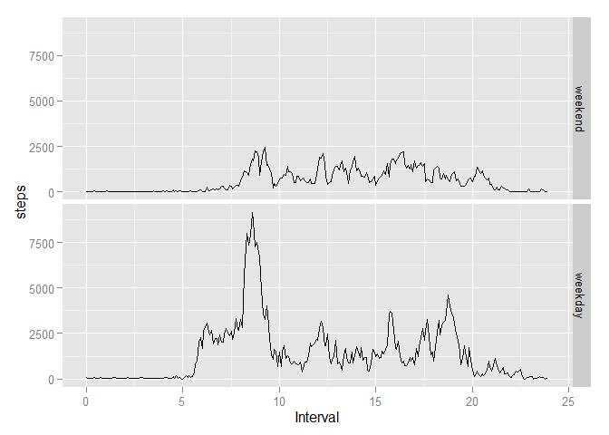

# My Assignment

## Loading and preprocessing the data


```r
library(ggplot2)
```

```
## Warning: package 'ggplot2' was built under R version 3.1.3
```

```r
setwd("c:\\users\\user\\desktop")
data = read.csv("activity.csv")
data$interval = (data$interval %% 100) / 60 + as.integer(data$interval / 100)
```

## What is mean total number of steps taken per day?

Total number of steps taken per day.


```r
stepPerDay = xtabs(steps ~ date, data = data)
print(as.data.frame(stepPerDay))
```

```
##          date  Freq
## 1  2012-10-01     0
## 2  2012-10-02   126
## 3  2012-10-03 11352
## 4  2012-10-04 12116
## 5  2012-10-05 13294
## 6  2012-10-06 15420
## 7  2012-10-07 11015
## 8  2012-10-08     0
## 9  2012-10-09 12811
## 10 2012-10-10  9900
## 11 2012-10-11 10304
## 12 2012-10-12 17382
## 13 2012-10-13 12426
## 14 2012-10-14 15098
## 15 2012-10-15 10139
## 16 2012-10-16 15084
## 17 2012-10-17 13452
## 18 2012-10-18 10056
## 19 2012-10-19 11829
## 20 2012-10-20 10395
## 21 2012-10-21  8821
## 22 2012-10-22 13460
## 23 2012-10-23  8918
## 24 2012-10-24  8355
## 25 2012-10-25  2492
## 26 2012-10-26  6778
## 27 2012-10-27 10119
## 28 2012-10-28 11458
## 29 2012-10-29  5018
## 30 2012-10-30  9819
## 31 2012-10-31 15414
## 32 2012-11-01     0
## 33 2012-11-02 10600
## 34 2012-11-03 10571
## 35 2012-11-04     0
## 36 2012-11-05 10439
## 37 2012-11-06  8334
## 38 2012-11-07 12883
## 39 2012-11-08  3219
## 40 2012-11-09     0
## 41 2012-11-10     0
## 42 2012-11-11 12608
## 43 2012-11-12 10765
## 44 2012-11-13  7336
## 45 2012-11-14     0
## 46 2012-11-15    41
## 47 2012-11-16  5441
## 48 2012-11-17 14339
## 49 2012-11-18 15110
## 50 2012-11-19  8841
## 51 2012-11-20  4472
## 52 2012-11-21 12787
## 53 2012-11-22 20427
## 54 2012-11-23 21194
## 55 2012-11-24 14478
## 56 2012-11-25 11834
## 57 2012-11-26 11162
## 58 2012-11-27 13646
## 59 2012-11-28 10183
## 60 2012-11-29  7047
## 61 2012-11-30     0
```

A histogram of the total number of steps taken each day.


```r
barplot(names.arg = names(stepPerDay), stepPerDay, xlab = "Intervals", ylab = "Steps")
```

 


The mean and median of the total number of steps taken per day.


```r
summary(as.vector(stepPerDay))[c("Mean", "Median")]
```

```
##   Mean Median 
##   9354  10400
```

## What is the average daily activity pattern?

A time series plot.


```r
freqPerInt = xtabs(steps ~ interval, data = data)
freqPerInt = freqPerInt / xtabs(!is.na(steps) ~ interval, data = data)
freqPerInt = as.data.frame(freqPerInt)
ggplot(freqPerInt, aes(x = as.numeric(as.character(interval)), y = Freq)) +
  geom_line() +
  xlab("Interval") + ylab("Steps") +
  xlim(0,24) + ylim(0, NA)
```

 

Which interval contains the maximun number of step.


```r
as.character(freqPerInt$interval[which.max(freqPerInt$Freq)])
```

```
## [1] "8.58333333333333"
```

## Imputing missing values

Summery of NAs in the data set.


```r
table(!complete.cases(data))
```

```
## 
## FALSE  TRUE 
## 15264  2304
```

Fill in the NAs.


```r
for(i in 1:dim(data)[1])
  if(is.na(data$steps[i]))
  {
    if(!is.na(freqPerInt$Freq[data$interval[i] / 5 + 1]))
      data$steps[i] = freqPerInt$Freq[data$interval[i] / 5 + 1]
    else
      data$steps[i] = stepPerDay[names(stepPerDay) == data$date[i]][1]
  }
```

Make a histogram of the total number of steps taken each day.


```r
stepPerDay = xtabs(steps ~ date, data = data)
barplot(stepPerDay)
```

 

Mean and median total number of steps taken per day.


```r
summary(as.vector(stepPerDay))[c("Median", "Mean")]
```

```
## Median   Mean 
##  10400   9373
```

## Are there differences in activity patterns between weekdays and weekends?

Create a new factor variable in data frame.


```r
data$weekday = factor(weekdays(as.Date(as.character(data$date))) %in% c("星期六","星期日"), levels = c(TRUE, FALSE), labels = c("weekend", "weekday"))
freqPerInt2 = as.data.frame(xtabs(steps ~ interval + weekday, data = data))
```

Creat final plot.


```r
ggplot(freqPerInt2, aes(x = as.numeric(as.character(interval)), y = Freq)) +
  geom_line() +  facet_grid(weekday ~ .) + 
  xlab("Interval")+ ylab("steps") +
  xlim(0,24) + ylim(0, NA)
```

 
